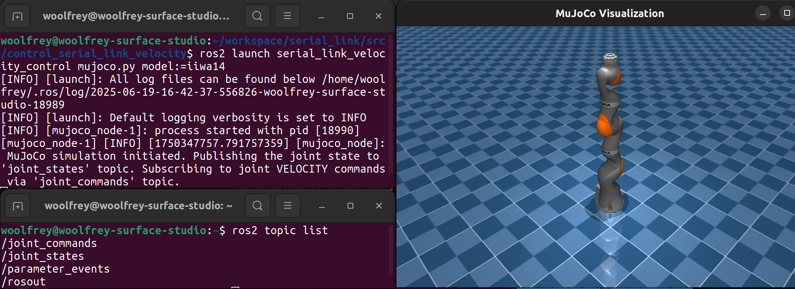
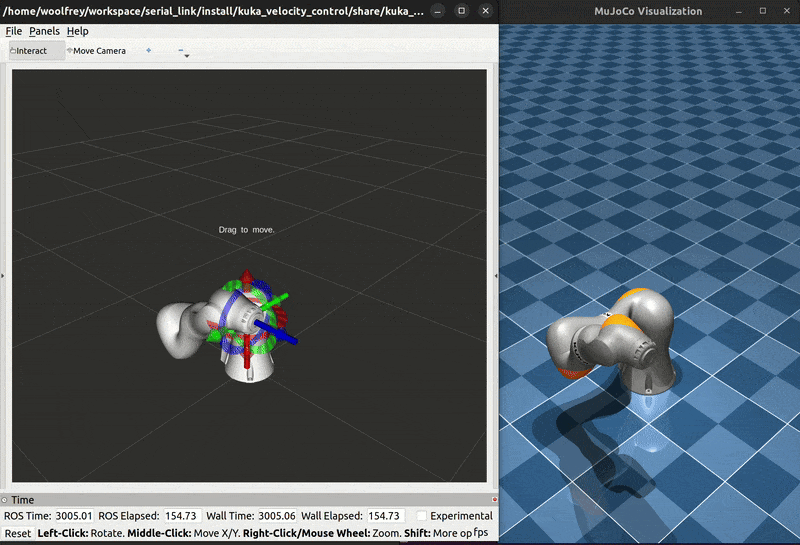

# 🎛️ Kuka Torque Control

This packages conatins launch files for coordinating the [serial_link_action_client](https://github.com/Woolfrey/client_serial_link) and [serial_link_action_server](https://github.com/Woolfrey/server_serial_link) packages to control a model of the Kuka iiwa robot (or any serial link robot, really) in torque mode. It has been tested in conjunction with the [mujoco_ros2](https://github.com/Woolfrey/mujoco_ros2) package.

It serves as an example of how to implement the [serial_link_action_client](https://github.com/Woolfrey/client_serial_link) package to send goals to the [serial_link_action_server](https://github/com/Woolfrey/server_serial_link) to control a robot arm, with all the necessary config files. You can copy and/or modify it to get it working for other robot arms :mechanical_arm:.

> [!WARNING]
> Use this controller on a real robot at your own risk.

✨ Features:
- Joint & Cartesian trajectory tracking,
- Real-time velocity control of the endpoint with a joystick,
- Real-time control of endpoint pose with an interactive marker in RViz.

<p align="center">
  
</p>

#### 🧭 Navigation
- [Requirements](#clipboard-requirements)
- [Installation](#floppy_disk-installation)
- [Configuration Files](#gear-configuration-files)
- [Launch Files](#rocket-launch-files)
- [Contributing](#handshake-contributing)
- [Citing this Repository](#bookmark_tabs-citing-this-repository)
- [License](#scroll-license)

## :clipboard: Requirements

- [Ubuntu 22.04](https://ubuntu.com/blog/tag/22-04-lts), or later,
- [ROS2 Humble](https://docs.ros.org/en/humble/index.html), or later, the
- The [serial link interfaces](https://github.com/Woolfrey/interface_serial_link) package,
- The [serial_link_action_server](https://github/com/Woolfrey/server_serial_link) package,
- The [serial_link_action_client](https://github/com/Woolfrey/client_serial_link) package,
- [Robot Library](https://github.com/Woolfrey/software_robot_library) (for the serial link action server),
- The [mujoco_ros2](https://gitub.com/Woolfrey/mujoco_ros2) (optional).

> [!NOTE]
> This package was built and tested using Ubuntu 22.04, ROS2 Humble, and MuJoCo 3.2.0.

[:top: Back to Top.](#%EF%B8%8F-kuka-torque-control)

## :floppy_disk: Installation

Your directory structure should end up looking something like this:
```
workspace/
├── software_robot_library/
└── ros2_ws/
    ├── build/
    ├── install/
    ├── log/
    └── src/
        ├── client_serial_link/
        ├── control_kuka_torque/
        ├── interface_serial_link/
        ├── mujoco_ros2/
        └── server_serial_link/
```

Download and install all the necessary packages.

[:top: Back to Top.](#%EF%B8%8F-kuka-torque-control)

## :gear: Configuration Files

There are several configuration files that you can modify to your liking:

| File | Purpose |
|------|---------|
| `control_parameters`        | Variables that influence control performance, such as feedback gains, singularity avoidance, etc.
| `iiwa_endpoint_poses`       | Specifies named Cartesian wayposes that are use to generate Cartesian trajectories. |
| `iiwa_joint_configurations` | Pre-determined joint configurations that are used to generate joint trajectories. |
| `tolerances`                | Tracking errors for the controller. The actions server will abort if these tolerances are violated. |
| `wii_nunchuck`              | Button mappings for a joystick when using the `joy_twist_mapper` node. |

[:top: Back to Top.](#%EF%B8%8F-kuka-torque-control)

## :rocket: Launch Files

> [!NOTE]
> I use bash scripts to simultaneously run the action client, and launch the action server. This is because the former allows you to type command prompts in to the terminal. This is not possible when you launch the client, instead of running.

### mujoco.py

If you don't have a real robot, you can use [this MuJoCo simulation](https://github.com/Woolfrey/mujoco_ros2/). All the necessary model files are located in the `mujoco/` directory.

Open a terminal, and run `ros2 launch kuka_torque_control mujoco.py` and it should start. You should also see the joint states being published, and the joint command topic ready to control the robot. You should see information specifying that it is running in torque mode:

<p align = "center">
  
</p>

### Following a Transform

This action server lets you follow a Cartesian transform using real-time feedback control.

Inside the `control_kuka_torque/` directory, type:
```
./launch_follow_transform.sh
```
and the relevant action clients & servers will start up.

In the client terminal:
1. Type `ready` to move the robot in to the ready configuration,
2. Move the interactive marker in the RViz window somewhere close to the robot end-effector transform, and
3. Type `follow` in the client terminal.

You should be able to drag around the interactive marker and the robot will automatically follow.

<p align="center">
  
</p>

### Following a Twist (Velocity) Command

This action lets you direct the endpoint of the robot in real time with a velocity command. You can connect a joystick and manually control the robot.

Inside the `control_kuka_torque/` directory, type:
```
./launch_follow_twist.sh
```
and the relevant action clients & servers will start up.

In the client terminal:
1. Type `ready` to move the robot in to the ready configuration,
2. Type `follow` in the client terminal.

A `joy` node is automatically run, and a `joy_twist_mapper` node (from the interface package). If you plug in a game controller or joystick, you can manually control the endpoint of the robot :joystick:.

You can change the joystick mapping in the `config/wii_nunchuck.yaml` file.

<p align="center">
  
</p>

### Joint & Cartesian Trajectory Tracking

This action server lets you generate joint and Cartesian trajectories to follow.

From the `control_kuka_torque/` directory type this in to a terminal:

```
./launch_track_trajectory.sh
```

This will start up the clients & servers for both joint & Cartesian velocity control:
1. Type `ready` to move the robot to the start configuration.
2. Try commands like `up`, `down`, `left`, `right`, etc. to move the endpoint of the robot in different directions.

Type `options` to see what is available.

<p align="center">
  
</p>

[:top: Back to Top.](#%EF%B8%8F-kuka-torque-control)

## :handshake: Contributing

Contributions to this repositore are welcome! Feel free to:
1. Fork the repository,
2. Implement your changes / improvements, then
3. Issue a pull request.

If you're looking for ideas, you can always check the [Issues tab](https://github.com/Woolfrey/control_kuka_torque/issues) for those with :raising_hand: [OPEN]. These are things I'd like to implement, but don't have time for. It'd be much appreciated, and you'll be tagged as a contributor :sunglasses:

[:top: Back to Top.](#%EF%B8%8F-kuka-torque-control)

## :bookmark_tabs: Citing this Repository

If you find this code useful, spread the word by acknowledging it. Click on `Cite this repository` under the **About** section in the top-right corner of this page :arrow_upper_right:.

Here's a BibTeX reference:
```
@software{woolfrey_kuka_torque_control_2025,
     author  = {Woolfrey, Jon},
     month   = apr,
     title   = {{K}uka {T}orque {C}ontrol},
     url     = {https://github.com/Woolfrey/control_kuka_velocity},
     version = {1.0.0},
     year    = {2025}
}
```
Here's the automatically generated APA format:
```
Woolfrey, J. (2025). Kuka Torque Control (Version 1.0.0). Retrieved from https://github.com/Woolfrey/control_kuka_torque
```

[:top: Back to Top.](#%EF%B8%8F-kuka-torque-control)

## :scroll: License

This software package is licensed under the [GNU General Public License v3.0 (GPL-3.0)](https://choosealicense.com/licenses/gpl-3.0/). You are free to use, modify, and distribute this package, provided that any modified versions also comply with the GPL-3.0 license. All modified versions must make the source code available and be licensed under GPL-3.0. The license also ensures that the software remains free and prohibits the use of proprietary restrictions such as Digital Rights Management (DRM) and patent claims. For more details, please refer to the [full license text](LICENSE).

[:top: Back to Top.](#%EF%B8%8F-kuka-torque-control)
